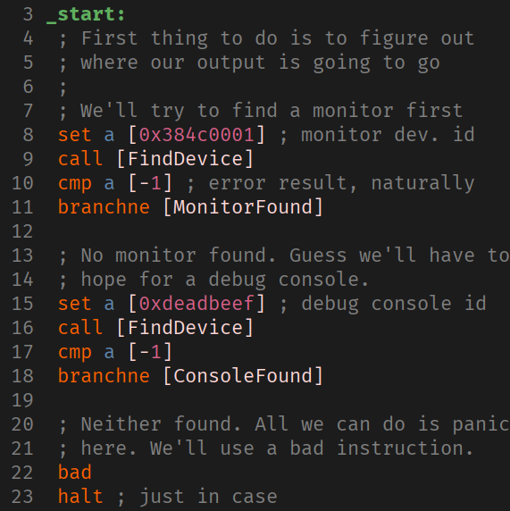

# Fai is sort of like an old mainframe or something.

* 32-bit words (and no 8-bit or 16-bit access!)
* 64-bit instructions, RISC-like
* [assembler](src/bin/assemble.rs), [debug/loader program](asm_examples/debug.fai)
* monitor access via WebSocket using [fai-client](https://github.com/devyn/fai-client)
  * or use the tty-based [emulator](src/bin/emulator.rs)
* might turn it into a game, idk

